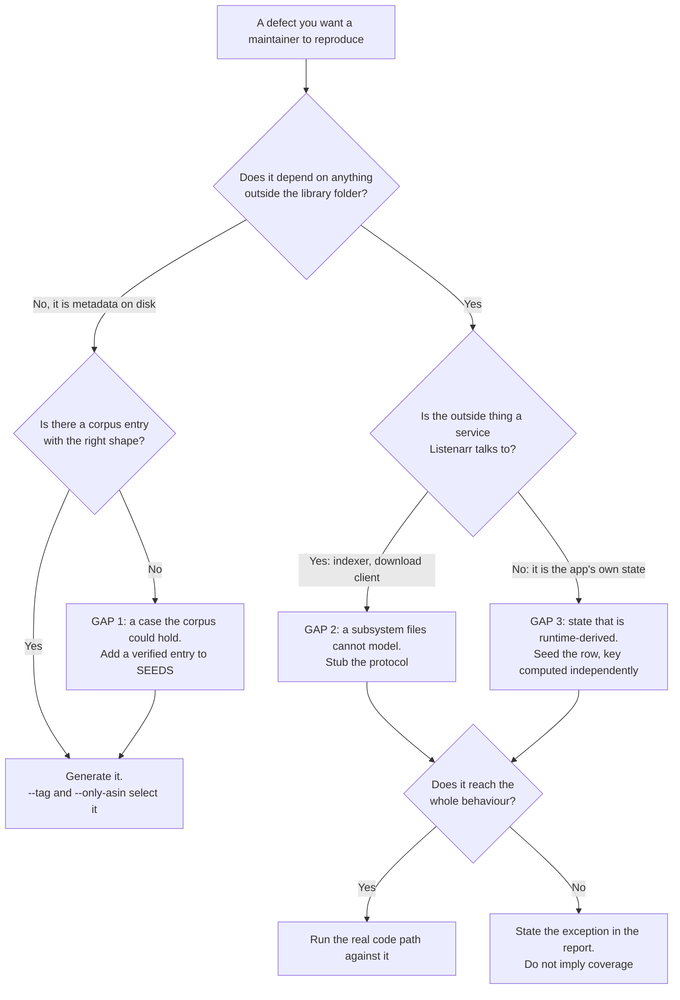

# What this corpus can and cannot reproduce

The point of this repository is that a maintainer can reproduce a bug instead of taking a report on trust. That only works if the limits are written down as carefully as the coverage, because a report that quietly overstates what was reproduced is worse than one that admits it reproduced nothing.

Three kinds of gap have turned up so far. They look similar when you hit them and they need completely different remedies, so the first job is telling them apart.

## Gap 1: a case the corpus could hold and does not

The defect is about metadata on disk, the generator has an axis for it, and the corpus simply contains no book with the right shape. The remedy is one more verified entry in `SEEDS`, which is cheap.

What makes this gap hard to notice is that a *nearby* case is usually already covered, so the axis looks green.

The worked example is author-name drift, filed upstream as the issue about `{Author}` resolving from a per-release literal string, which lands one author in several folders. The corpus does contain record-level author drift. It contains four pairs:

| Author | One record credits | Another credits | Kind of drift |
|---|---|---|---|
| Barrie | `J.M. Barrie` | `James M. Barrie` | abbreviation |
| Montgomery | `L. M. Montgomery` | `Lucy Maud Montgomery` | abbreviation |
| Goethe | `Johann Wolfgang von Goethe` | `Johann Wolfgang Goethe` | dropped particle |
| Grimm | `Brüder Grimm` | `Brothers Grimm` | translated name |

Not one of them is punctuation-only. There is no pair whose spellings agree once you drop the dots and spaces, which is the exact class a punctuation-normalising fix collapses. So a fix aimed at `J.M.` versus `J. M.` versus `J M` has no public reproduction here at all, and the closest thing to one demonstrates a case the fix leaves alone.

Two things hid that. The first is that the generator has an `author-variant` tag state, so the failure mode reads as covered. It is not the same thing: that axis writes a variant spelling into a **file's tags**, which models a file disagreeing with its record. The issue is about two **records** crediting one author differently, which is what makes `{Author}` render two folder names. No tag-level transform can produce it. Only a second corpus entry can.

The second is that the rule meant to generate Barrie's variant had matched nothing since the day it was written, because it was keyed on `J. M. Barrie` and the corpus credits `J.M. Barrie`. Two more rules in the same table were dead the same way. `TestAuthorVariants` now asserts that every rule matches a name the corpus actually credits, so the next dead rule fails the suite rather than silently generating nothing.

**The lesson worth keeping:** an axis existing is not evidence that a case exists. Ask what is in `corpus.json`, not what the generator can do.

## Gap 2: a subsystem files on disk cannot model

The behaviour starts outside the filesystem. Indexers, download clients, torrents, trackers. No arrangement of generated files produces a zero-seed torrent, a stalled grab, a 409 on a duplicate info-hash, or a release whose title matches every book in a series at once.

The remedy is a stub that speaks the protocol rather than a library that implies it:

- `tools/torznab_stub.py` answers `t=caps` and `t=search`, so the search side exists at all. `--box-set` serves one release that satisfies every book in a series, which is the input an application that tracks what a release was *grabbed for* rather than what it *satisfies* gets wrong.
- `tools/qbittorrent_stub.py` implements the routes Listenarr's qBittorrent adapter actually calls. A queue-poll bug is triggered by a response, so the thing to generate is the client, not the library.

A stub is bounded by what it chooses to serve. It does not model a real swarm, a real tracker, or timing, and where the defect lives in one of those, say so. An exception stated is a scoped report. An exception left out reads as coverage that was never there.

## Gap 3: state that is runtime-derived rather than file-derived

The defect depends on a row that only exists after the application has already run: enrichment output, blocklist entries, history. Generating a library and scanning it to arrive at that row is slow, indirect, and frequently cannot reach the exact row you need, because the path there runs through the code you are trying to test.

The remedy is to seed the row directly and then run the real code path against it. This has already settled a blocklist question that neither a corpus case nor an anecdote from a running install could settle.

The load-bearing part is easy to lose: **the key in the seeded row must be computed independently of the code under test.** Deriving it with the same function the application uses proves only that the function agrees with itself, which is true of a broken one. Compute it from the documented shape, seed it, and let the real code path find it or fail to.

`tools/verify_scan.py --db` already reads a Listenarr SQLite file, so the reading half of this exists. The writing half is a technique someone has to remember rather than a tool anyone can run, which is a candidate for the next thing to build here.

## Out of scope on purpose

- **Anything that only reproduces because of a private setup.** This is the founding rule of the repository: a case that cannot be regenerated from `corpus.json` plus the generator does not belong here.
- **Real audio.** Generated files are one second of digital silence, tagged at generation time. A defect that depends on decoding real content cannot be reproduced from this repository, and nothing here should be read as claiming otherwise.
- **Real network services.** Stubs answer the calls Listenarr makes. They are not the services.

## Saying which gap you hit

In an upstream report, name the gap. "The corpus cannot reproduce this" invites the reader to discount everything around it. "This is download-client behaviour, so the harness stubs the client instead of generating files, and the stub does not model swarm timing" tells them exactly how far the evidence goes and where it stops.
